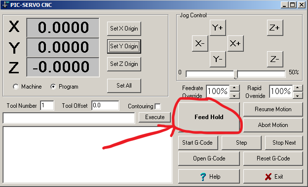
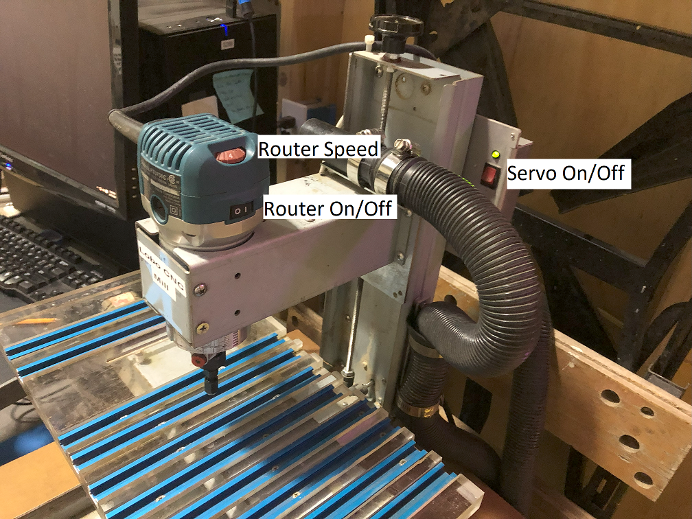
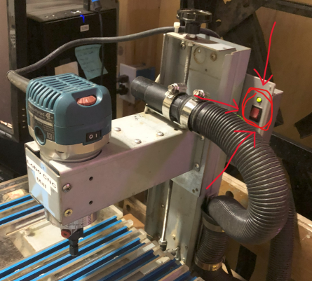
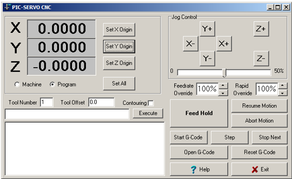

# Lobo CNC Mill  
## General Process
Ideally you came here with a general understanding of the CNC Milling process.

If not, the generic CNC milling process consists of:  
**A. Capture your design in a computer program.**  
Not addressed in this guide.  
**B. Transform your design into CNC Tool instructions (G-code).**  
Not addressed in this guide.  
**C. Setup the Tool and run the Tool Instructions (G-code).**  
The ==objective of this guide==: How to set up and run the Lobo CNC Mill. 

**The assumption is you are here with your G-code in a text file.**  

## Safety
This guide assumes you have an understanding of personal safety involving machinery. This is a strong, sharp, spinning machine that may move without warning. It can be loud and throw shrapnel at any time. If you have questions, concerns, or are unsure about your safety, ask someone first.  

To **STOP all mill movement**, click on the Feed Hold button, on the display.  
This **WILL NOT Stop the Router Bit** from spinning.  

  
To **Stop the router from spinning, turn off the router power**.  
  
  
## General/Overview  
### Electronics Switch  
  

### Knobs  
When the mill is not performing any automated activities , the physical position (X, Y, & Z) can be adjusted using the three control knobs.  

### Axes  
The mill uses the normal Cartesian Coordinate system (X, Y, & Z). However, because the workpiece moves in the X-Y planes relative to the cutting tool, the movement directions (+/-) can be counter intuitive. For example, when the X position is increased, the bed/workpiece will move to the left and NOT the right (the direction of increasing X). But from the bed/workpiece perspective, increasing X DOES move the the cutting tool to the right (the direction of increasing X) because the bed/workpiece is moving left and the cutting tool is remaining still.

### Bed Dimensions
TBD - X, Y, Z dimentions here
Imperial maximum dimentions:
  - X:  
  - Y:  
  - Z:  

Metric maximum dimentions:  
  - X:  
  - Y:  
  - Z:  

## Inputs to this process
### G-code
G-code is a text file with step-by-step instructions for the mill. This typically comes from the CAM process.  

**You will need to know the following about your G-code:**  
- **The units** - When the G-code was generated, either Metric or Imperial units were used. Some G-code generators will state the units used. If the file starts with “G20”, then the units are in inches. If it starts with “G21”, then the units are in millimeters. The Lobo CNC Software is NOT smart enough to read this and adjust accordinly. You must run the correct program based on this information. See [Imperial (Inches) or Metric (Millimeters)](https://github.com/Air-Light-Time-Space/wiki/blob/A4E-AddLoboCNC/src/Lobo_CNC/Lobo_CNC_Mill.md#imperial-inches-or-metric-millimeters).  

- **The origin of the model** - When the G-code was generated, it was relative to the origin, X=0, Y=0, Z=0. All motions and dimensions in the G-code are relative to this location. This is typically one of the top corners of the material, but may be anywhere convenient.

- **The Bit Size & Shape**. See below under [Cutting Bit](https://github.com/Air-Light-Time-Space/wiki/blob/A4E-AddLoboCNC/src/Lobo_CNC/Lobo_CNC_Mill.md#cutting-bit).  
  
### Material to Cut  
This is the stuff you want to mill your design from or into. 
> “The sculpture is already complete within the marble block… I just have to chisel away the superfluous material.” ― Michelangelo  

The material is typically foam, wood, or plastic. The Lobo Mill will struggle to simply engrave soft metals like aluminum. Attempting harder materials is a bad idea.  

### Cutting Bit  
- **Bite Type** - The bit must be appropriate for the material being cut. The wrong type can burn or melt your material or be quickly dulled by the material.  
- **Bit Size & Shape** - The G-code was generated based on this bit and if a different size or shape is used, the results will be different than intended. For example if a larger diameter mill is used, more material will be removed than specified.  

The use of multiple bits is not covered in this guide. The Lobo CNC interpreter does support multiple tools, but there is no tool changer and the changes must occur manually.  

## Assumptions  
The Lobo CNC Mill is already connected to a dedicated PC with the appropriate software installed and configured. Any connecting or configuring is beyond the scope of this simple guide.  

# Setup for the Lobo CNC Mill  
## Start the Software & Homing  

### Imperial (Inches) or Metric (Millimeters)  
There are two Icons on the PC desktop:  
- LoboCNC - Inches  
- LoboCNC - Millimeters  
See the units discussion in the [Inputs/G-code](https://github.com/Air-Light-Time-Space/wiki/blob/A4E-AddLoboCNC/src/Lobo_CNC/Lobo_CNC_Mill.md#g-code) section.

Double-click the Icon for the units you wish to use.  

### Servo Control Power  
When the software prompts you to, turn on the Servo Control Power.  
(No Worries if it is already on.)  

 
### Homing  
Next, the software will ask: Do you want to execute the homing process?  
With rare exceptions, answer **yes** to this.  

The Lobo Mill knows where it is by counting the rotations of the threaded shafts. Homing is the process where it moves to the stops of each axis (a known location)  and then zeros that count. Thus, ensuring that the count is correct.  

### Done Homing  
Once the software is done homing, the CNC Control Window will be displayed:  

## Mill Setup  
### Test Options
It is rare to get your expected results from the first run of the G-code.  There will typically be an iterative process of “dialing it in” needed. 

It is recommended to test at least the first portion of your G-code with no bit installed, no material installed, and with the router turned off. This will allow you to watching for the mill exceeding the bed limits of your material or crashing the cutting bit into something.  

Even after you have some confidence in the G-code, it is recommended that you try the first cutting on **Scrap Material First**.

The following is the setup instructions for using the mill. There are additional  
**[Suggestions for Testing Your Setup]**   
if you wish to use them. When you are ready to cut for real, repeat the instructions without those suggestions. 

### Setup the Cutting Bit and Material  
1. Install your material to be milled. *[For Testing, first do not install any material. Second use scrap material to confirm results.]*  
   How to attach your materiel to the mill table will depend on the type of milling you are performing and is beyond the scope of this guide.  
   In general:  
 - Your material must be secure enough to never move while being milled. Large portions (larger than chips) being removed must not be allowed to come loose.  
 - If held down by clamps, they must not be located where the bit will collide with them.  
 - DO NOT mill into the mill bed. If your material will be milled all the way through, sufficient sacrificial material (spoiler board) must be used underneath.  
2. Install the cutting bit into the Router. *[For Testing, Leave the Bit Uninstalled]*  
 - Be sure to use the bit that was used for generation of your G-code. i.e., The Diameter of the cutting portion and Shape of the End (End mill, Ball, Tapered,...)
 - Be sure to use the bit intended to but your material. The wrong type can burn or melt your material or be quickly dulled by the material.  

### Zero the Mill Location  
1. Move the mill so that the end of the bit is located at the the Origin of the model using the X, Y, & Z +/- buttons on the CNC Control Window. (Or the CNC knobs, if need be)  
   *[If no bit or material are installed, locate the mill approxamately, as if they were installed.]*  
   *[Alternately, locate the end of the bit much higher than normal - so that all G-code Z movements will NOT contact the table/material]*  

2. Zero the X, Y, & Z coordinates by clicking the "Set All" button.  

3. Advance Setup:
     - You can zero individual axes by clicking the "Set X/Y/Z Origin" button  
     - You can enter specific offset numbers by clicking in the number windows  

### Load the G-Code
1. Click the "Open G-Code" Button.  
2. Navigate to your G-code file and open it.
  
Here is where you need to be warned that the Lobo CNC software uses a **"Reduced G-code Instruction Set"**. Meaning that it only understands "basic" G-code instructions. And unfortunately, the software will simply ignore G-code instructions that it does not recognize, with no caution to the user. The best solution to this issue is to use a CAM output setting for “simpler mills”. I have had good results from CAMs that can generate code for a “Generic Linux CNC”. Barring that, you may need to ask for help or learn some G-code to alter your file.
  
As the G-code runs, the lines being executed will be displayed. The highlighted line indicates the NEXT instruction to be executed, the line above the highlighting is the instruction currently being executed.  
    At this point, be watchful and ready to stop the mill if it goes rogue. See the [Safety](https://github.com/Air-Light-Time-Space/wiki/blob/A4E-AddLoboCNC/src/Lobo_CNC/Lobo_CNC_Mill.md#safety) section above for stopping things.  

# Run the G-Code
The next step will start the execution of the G-code. This is a quick reminder that:   
    - To **stop the mill's movement** click the **Feed Hold button**  
    - To **stop the Router from turning, turn the router OFF**  
    
1. Click the "Start G-code" button, to run the G-code.  
2. Most G-codes will display a window to "Turn on the Router". *[If you are testing with no intent to cut, leave the router turned OFF]*
3. Click the OK button.
4. **Carefully watch the mill behavior and stop it if there are problems or concerns.**
5. When done, click the Exit button on the display and turn off the router.

## G-Code Troubleshooting and Tweaking
As you become more experienced, there are more features available from the Lobo CNC software. e.g.,  
- Pausing/Resuming the G-code  
- Single stepping through the G-code
- Adjusting the movement speed while running
- Executing single G-code commands manually

# More Lobo CNC Info
You can read the instructions that came with the Lobo CNC Mill by clicking on the "Help" button on the display.  Or, see them here [HERE](./pscnc.pdf), if you dare.  

Keep in mind that the Lobo CNC Mill was a DIY kit from over a decade ago. The instructions are detailed and assume the reader is either experienced or not afraid to experiment. It is my genuine hope that this guide helps you to become both.

# More CNC Info In General
My name is Jim Schultz, and I started this guide. I have zero training in milling or in CNC, and all of my knowledge is from reading, asking questions, or trial & error. If you want to risk my help with this mill, I would be happy to try. You can find me on the [AltSpace Discord](https://discord.com/channels/834243114339401759/834243114339401762).

Other Contributors and/or Milling/CNC advisors:
<name here>
